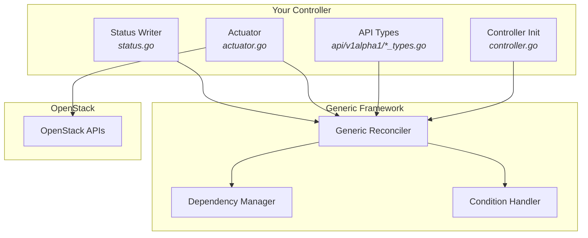

# Developing controllers

This documentation covers how to write a new ORC controller from scratch.

## Overview

ORC controllers follow a unified pattern built on the generic reconciler framework. Each controller:

- Defines a **Kubernetes API (CRD)** for the OpenStack resource
- Implements an **actuator** that performs CRUD operations against OpenStack
- Uses the **generic reconciler** to handle common logic (status, conditions, dependencies)

## Prerequisites

See the [local development quickstart](quickstart.md) for setting up your environment.

## Reference documentation

- [Controller implementation](controller-implementation.md) - Conditions, errors, and dependency management
- [Architecture](architecture.md) - Architectural decisions and rationale
- [Coding Standards](coding-standards.md) - Code style and patterns

### Generated documentation

- [Interface reference](godoc/generic-interfaces.md) - Documentation for controller interfaces
- [ReconcileStatus reference](godoc/reconcile-status.md) - Documentation for ReconcileStatus
