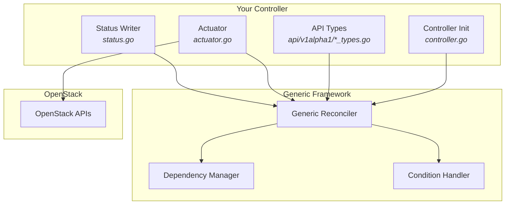

# Developing controllers

This documentation covers how to write a new ORC controller from scratch.

ORC controllers follow a unified pattern built on the generic reconciler
framework. Each controller:

- Defines a **Kubernetes API (CRD)** for the OpenStack resource
- Implements an **actuator** that performs CRUD operations against OpenStack
- Implements a **status writer** that maps OpenStack state to Kubernetes status
- Uses the **generic reconciler** to handle common logic (status, conditions, dependencies)

```mermaid
flowchart TB
    subgraph Your Controller
        api[API Types<br/><i>api/v1alpha1/*_types.go</i>]
        actuator[Actuator<br/><i>actuator.go</i>]
        status[Status Writer<br/><i>status.go</i>]
        controller[Controller Init<br/><i>controller.go</i>]
    end

    subgraph Generic Framework
        reconciler[Generic Reconciler]
        deps[Dependency Manager]
        conditions[Condition Handler]
    end

    subgraph OpenStack
        osapi[OpenStack APIs]
    end

    controller --> reconciler
    api --> reconciler
    actuator --> reconciler
    status --> reconciler
    reconciler --> deps
    reconciler --> conditions
    actuator --> osapi
```

## Prerequisites

See the [Development Quickstart](quickstart.md) for setting up your environment.

## Getting started

Start by [scaffolding a new controller](scaffolding.md), which generates the
boilerplate and `TODO(scaffolding)` markers that point you to the relevant
pages:

- **[API Design](api-design.md)**: Define the CRD types (spec, filter, status)
- **[Controller Initialisation](controller-init.md)**: Wire up dependencies and `SetupWithManager`
- **[Resource Interfaces](interfaces.md)**: Implement the actuator (CRUD operations)
- **[Controller Implementation](controller-implementation.md)**: Conditions, errors, and reconciliation
- **[Writing Tests](writing-tests.md)**: Add kuttl E2E tests and API validation tests

## Reference controllers

When implementing a new controller, use these existing controllers as examples:

| Controller | Complexity | Notable features |
|-----------|-----------|-----------------|
| `internal/controllers/servergroup/` | Simple | No dependencies, fully immutable |
| `internal/controllers/flavor/` | Simple | Immutable except extra specs (`reconcileExtraSpecs`) |
| `internal/controllers/securitygroup/` | Medium | Project dependency, rules reconciliation |
| `internal/controllers/trunk/` | Medium | `updateResource` + `reconcileSubports` + tags |
| `internal/controllers/server/` | Complex | Multiple dependencies, many reconcilers |

## Reference documentation

- [Architecture](architecture.md): Adoption, implicit behavior overrides
- [Coding Standards](coding-standards.md): Code style and patterns
- [Interface reference](godoc/generic-interfaces.md): Generated documentation for controller interfaces
- [ReconcileStatus reference](godoc/reconcile-status.md): Generated documentation for ReconcileStatus
