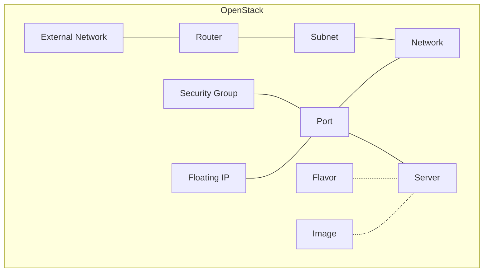

# Tutorial: Deploy Your First Server

This tutorial walks you through deploying a virtual machine with full networking
on OpenStack, entirely from Kubernetes. By the end, you'll have a running server
with a floating IP address that you can ping.

Along the way, you'll learn ORC's [core concepts](concepts/core-concepts.md): **managed** and **unmanaged**
resources, **resource references**, **automatic dependency handling**, and how to
inspect **status and conditions**.

## Prerequisites

- ORC installed in your Kubernetes cluster (see [Installation](installation.md))
- An OpenStack cloud with:
    - An external (provider) network
    - A flavor available for your project (e.g. `m1.small`)
    - An image available for your project (e.g. `cirros` or `ubuntu`)
    - Sufficient quota for a network, subnet, router, security group, port,
      floating IP, and server
- `kubectl` configured to access your cluster

## What we'll build



We'll create all of these resources as Kubernetes objects. ORC handles the
OpenStack API calls and ensures everything is created in the right order.

## Step 1: Set up credentials

Create a secret containing your OpenStack `clouds.yaml`:

```bash
kubectl create secret generic openstack-clouds \
    --from-file=clouds.yaml=/path/to/your/clouds.yaml
```

!!! tip

    You can download your `clouds.yaml` from the OpenStack dashboard under
    **API Access** → **Download OpenStack RC File** → **clouds.yaml**.
    For custom CA certificates and other credential options, see
    [Set Up Cloud Credentials](howto/cloud-credentials.md).

In the examples below, we use `cloudName: openstack`. Replace this with the name
of your cloud entry in `clouds.yaml` if it differs.

## Step 2: Import existing resources

Your OpenStack cloud already has shared resources: an external network for
internet access and flavors that define VM sizes. We don't want ORC to *create*
these; we want it to *import* them so other ORC resources can reference them.

This is what `managementPolicy: unmanaged` is for. ORC will find the resource in
OpenStack and expose it as a Kubernetes object, but it won't modify or delete it.

### Import the external network

First, find the name of your external network:

```bash
openstack network list --external
```

Now create an ORC Network object that imports it. Replace `public` with your
external network's name:

```yaml
kubectl apply --server-side -f- <<EOF
apiVersion: openstack.k-orc.cloud/v1alpha1
kind: Network
metadata:
  name: external-network
spec:
  cloudCredentialsRef:
    cloudName: openstack
    secretName: openstack-clouds
  managementPolicy: unmanaged
  import:
    filter:
      name: public
      external: true
EOF
```

### Import a flavor

Find a flavor to use for your server:

```bash
openstack flavor list
```

Import it by name. Replace `m1.small` with a flavor available on your cloud:

```yaml
kubectl apply --server-side -f- <<EOF
apiVersion: openstack.k-orc.cloud/v1alpha1
kind: Flavor
metadata:
  name: my-flavor
spec:
  cloudCredentialsRef:
    cloudName: openstack
    secretName: openstack-clouds
  managementPolicy: unmanaged
  import:
    filter:
      name: m1.small
EOF
```

### Import an image

Import an existing image. Replace `cirros` with an image available on your cloud:

```yaml
kubectl apply --server-side -f- <<EOF
apiVersion: openstack.k-orc.cloud/v1alpha1
kind: Image
metadata:
  name: my-image
spec:
  cloudCredentialsRef:
    cloudName: openstack
    secretName: openstack-clouds
  managementPolicy: unmanaged
  import:
    filter:
      name: cirros
EOF
```

### Verify the imports

Check that all three resources are available:

```bash
kubectl get networks,flavors,images
```

Expected output:

```
NAME                                             ID                                     AVAILABLE   MESSAGE
network.openstack.k-orc.cloud/external-network   c81746dd-375a-4fcb-b33d-ee97a801f027   True        OpenStack resource is up to date

NAME                                     ID   AVAILABLE   MESSAGE
flavor.openstack.k-orc.cloud/my-flavor   2    True        OpenStack resource is up to date

NAME                                   ID                                     AVAILABLE   MESSAGE
image.openstack.k-orc.cloud/my-image   03046f35-421b-46cd-8634-de2fbc6254e1   True        OpenStack resource is up to date
```

!!! note "What if an import isn't working?"

    If an import filter matches **no** resources, ORC keeps retrying: the
    resource stays `Progressing: True` with a message like *"Waiting for
    OpenStack resource to be created externally"*. Double-check the filter
    values (names are case-sensitive).

    If a filter matches **multiple** resources, ORC reports an error with
    `Progressing: False`. Make the filter more specific.

    See [Troubleshooting](troubleshooting.md#common-issues) for more
    debugging steps.

## Step 3: Create a network and subnet

Now we'll create **managed** resources: resources that ORC fully controls. It
will create them in OpenStack, keep their status in sync, and delete them when
we delete the Kubernetes objects.

Create a private network:

```yaml
kubectl apply --server-side -f- <<EOF
apiVersion: openstack.k-orc.cloud/v1alpha1
kind: Network
metadata:
  name: my-network
spec:
  cloudCredentialsRef:
    cloudName: openstack
    secretName: openstack-clouds
  managementPolicy: managed
  resource:
    description: Tutorial network
EOF
```

Create a subnet on that network:

```yaml
kubectl apply --server-side -f- <<EOF
apiVersion: openstack.k-orc.cloud/v1alpha1
kind: Subnet
metadata:
  name: my-subnet
spec:
  cloudCredentialsRef:
    cloudName: openstack
    secretName: openstack-clouds
  managementPolicy: managed
  resource:
    networkRef: my-network
    cidr: 192.168.1.0/24
    ipVersion: 4
EOF
```

Notice the `networkRef: my-network` field. This is a **resource reference**: it
tells ORC that the subnet depends on `my-network`. ORC automatically:

- **Waits** for `my-network` to be available before creating the subnet
- **Prevents deletion** of `my-network` while the subnet still exists

You can apply both resources in any order; ORC handles the sequencing.

Verify:

```bash
kubectl get networks,subnets
```

```
NAME                                             ID                                     AVAILABLE   MESSAGE
network.openstack.k-orc.cloud/external-network   c81746dd-375a-4fcb-b33d-ee97a801f027   True        OpenStack resource is up to date
network.openstack.k-orc.cloud/my-network         a1b2c3d4-e5f6-7890-abcd-ef1234567890   True        OpenStack resource is up to date

NAME                                     ID                                     AVAILABLE   MESSAGE
subnet.openstack.k-orc.cloud/my-subnet   f1e2d3c4-b5a6-7890-fedc-ba0987654321   True        OpenStack resource is up to date
```

## Step 4: Create a router

To give our network internet access, we need a router that connects our subnet
to the external network:

```yaml
kubectl apply --server-side -f- <<EOF
apiVersion: openstack.k-orc.cloud/v1alpha1
kind: Router
metadata:
  name: my-router
spec:
  cloudCredentialsRef:
    cloudName: openstack
    secretName: openstack-clouds
  managementPolicy: managed
  resource:
    description: Tutorial router
    externalGateways:
      - networkRef: external-network
EOF
```

Connect the subnet to the router using a RouterInterface:

```yaml
kubectl apply --server-side -f- <<EOF
apiVersion: openstack.k-orc.cloud/v1alpha1
kind: RouterInterface
metadata:
  name: my-router-interface
spec:
  type: Subnet
  routerRef: my-router
  subnetRef: my-subnet
EOF
```

!!! note

    RouterInterface is different from other ORC resources: it has no
    `cloudCredentialsRef` or `managementPolicy`. It inherits credentials from
    the referenced router.

Wait for the router interface to be available:

```bash
kubectl get routers,routerinterfaces
```

```
NAME                                       ID                                     AVAILABLE   MESSAGE
router.openstack.k-orc.cloud/my-router     b2c3d4e5-f6a7-8901-bcde-f12345678901   True        OpenStack resource is up to date

NAME                                                        ID                                     AVAILABLE   MESSAGE
routerinterface.openstack.k-orc.cloud/my-router-interface   c3d4e5f6-a7b8-9012-cdef-123456789012   True        OpenStack resource is up to date
```

## Step 5: Create a security group

By default, OpenStack blocks all incoming traffic. We need a security group that
allows ICMP (ping) so we can verify our server is reachable:

```yaml
kubectl apply --server-side -f- <<EOF
apiVersion: openstack.k-orc.cloud/v1alpha1
kind: SecurityGroup
metadata:
  name: allow-icmp
spec:
  cloudCredentialsRef:
    cloudName: openstack
    secretName: openstack-clouds
  managementPolicy: managed
  resource:
    description: Allow ICMP traffic
    rules:
      - description: Allow ping
        direction: ingress
        protocol: icmp
        ethertype: IPv4
EOF
```

## Step 6: Create a port and server

A port connects a server to a network. Create one with our security group:

```yaml
kubectl apply --server-side -f- <<EOF
apiVersion: openstack.k-orc.cloud/v1alpha1
kind: Port
metadata:
  name: my-port
spec:
  cloudCredentialsRef:
    cloudName: openstack
    secretName: openstack-clouds
  managementPolicy: managed
  resource:
    networkRef: my-network
    securityGroupRefs:
      - allow-icmp
    addresses:
      - subnetRef: my-subnet
EOF
```

Now create the server:

```yaml
kubectl apply --server-side -f- <<EOF
apiVersion: openstack.k-orc.cloud/v1alpha1
kind: Server
metadata:
  name: my-server
spec:
  cloudCredentialsRef:
    cloudName: openstack
    secretName: openstack-clouds
  managementPolicy: managed
  resource:
    imageRef: my-image
    flavorRef: my-flavor
    ports:
      - portRef: my-port
EOF
```

The server has three resource references: `imageRef`, `flavorRef`, and
`portRef`. ORC waits for all of them to be available before asking OpenStack to
create the server.

Watch the server come up:

```bash
kubectl get server my-server -w
```

```
NAME        ID                                     AVAILABLE   MESSAGE
my-server   0357c57f-51d9-401a-9b3f-ff16003708dc   False       Waiting for OpenStack resource to be ready...
my-server   0357c57f-51d9-401a-9b3f-ff16003708dc   False       Waiting for OpenStack resource to be ready...
my-server   0357c57f-51d9-401a-9b3f-ff16003708dc   True        OpenStack resource is up to date
```

Press ++ctrl+c++ to stop watching.

## Step 7: Assign a floating IP

To reach the server from outside the OpenStack cloud, create a floating IP and
attach it to the port:

```yaml
kubectl apply --server-side -f- <<EOF
apiVersion: openstack.k-orc.cloud/v1alpha1
kind: FloatingIP
metadata:
  name: my-fip
spec:
  cloudCredentialsRef:
    cloudName: openstack
    secretName: openstack-clouds
  managementPolicy: managed
  resource:
    floatingNetworkRef: external-network
    portRef: my-port
EOF
```

Wait for it to be ready:

```bash
kubectl get floatingip my-fip
```

```
NAME     ID                                     AVAILABLE   ADDRESS       MESSAGE
my-fip   ccfd0a8f-b0d9-4356-a8c1-c938ca7abdd9   True        172.24.4.91   OpenStack resource is up to date
```

## Step 8: Verify it works

The `ADDRESS` column in the previous step shows the floating IP that OpenStack
assigned. Ping it from a host that can reach your OpenStack external network:

```bash
ping -c 3 $(kubectl get floatingip my-fip -o jsonpath='{.status.resource.floatingIP}')
```

```
PING 172.24.4.91 (172.24.4.91): 56 data bytes
64 bytes from 172.24.4.91: icmp_seq=0 ttl=63 time=2.1 ms
64 bytes from 172.24.4.91: icmp_seq=1 ttl=63 time=1.3 ms
64 bytes from 172.24.4.91: icmp_seq=2 ttl=63 time=1.5 ms
```

🎉 Your server is running and reachable, deployed entirely from Kubernetes!

## Step 9: Inspect the deployment

Let's look at everything we created:

```bash
kubectl get openstack
```

This lists all ORC resources in the current namespace. You can also inspect the
full observed state of any resource. For example:

```bash
kubectl get server my-server -o yaml
```

The `.status.resource` field contains the state as observed from OpenStack,
including fields that OpenStack assigns (like `hostID` and addresses).

## Cleanup

Delete all the resources we created:

```bash
kubectl delete floatingip my-fip
kubectl delete server my-server
kubectl delete port my-port
kubectl delete securitygroup allow-icmp
kubectl delete routerinterface my-router-interface
kubectl delete router my-router
kubectl delete subnet my-subnet
kubectl delete network my-network

# These are unmanaged: deleting the ORC objects does not
# delete the underlying OpenStack resources
kubectl delete flavor my-flavor
kubectl delete image my-image
kubectl delete network external-network
```

ORC deletes managed resources from OpenStack automatically. Dependency ordering
is enforced: if you delete everything at once, ORC will delete them in the
correct order (e.g., the subnet is deleted before the network).

```bash
# Delete all ORC resources at once (alternative to the above)
kubectl delete openstack --all
```

## What you've learned

- **Managed resources** (`managementPolicy: managed`) are fully controlled by ORC: created, updated, and deleted.
- **Unmanaged resources** (`managementPolicy: unmanaged`) import existing OpenStack resources without modifying them.
- **Resource references** (`*Ref` fields) create dependencies between resources. ORC handles ordering automatically.
- **Status conditions** (`Available` and `Progressing`) tell you whether a resource is ready or still being worked on.
- **`kubectl get openstack`** lists all ORC resources at once.

!!! tip

    If you'd prefer to skip the manual YAML and use pre-built kustomize
    overlays instead, see [Running Examples](development/running-examples.md).

## Next steps

- **[Core Concepts](concepts/core-concepts.md)**: Deeper coverage of management policies, imports, and deletion behavior
- **[Drift Detection](concepts/drift-detection.md)**: Periodically re-sync resources to detect out-of-band changes
- **[CRD Reference](crd-reference.md)**: Full documentation of all resource types and fields
- **[Troubleshooting](troubleshooting.md)**: Diagnose and fix common issues
