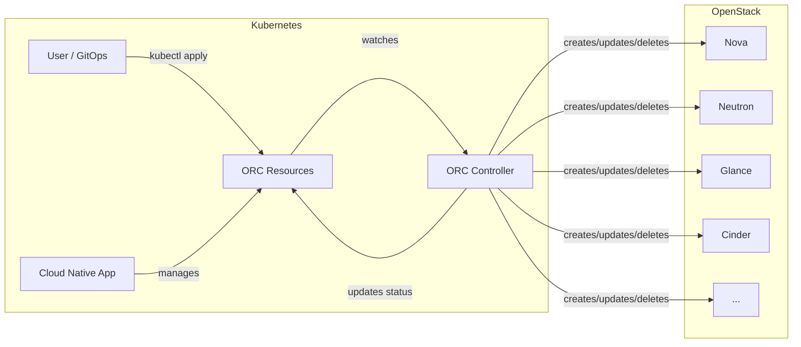

# openstack-resource-controller

_Deploy your OpenStack resources in a declarative way, using Kubernetes._

## What is ORC?

[**openstack-resource-controller**][orc], or **ORC**, is a Kubernetes API for
declarative management of OpenStack resources. By fully controlling the order
of OpenStack operations, it allows consumers to easily create, manage, and
reproduce complex deployments. ORC aims to be easily consumed both directly by
users, and by higher level controllers. ORC aims to cover all OpenStack APIs
which can be expressed declaratively.

ORC is based on [Gophercloud][gophercloud], the OpenStack Go SDK.

[orc]: https://github.com/k-orc/openstack-resource-controller
[gophercloud]: https://github.com/gophercloud/gophercloud

[Get Started](installation.md){ .md-button .md-button--primary }
[User Guide](user-guide/index.md){ .md-button }

## How It Works

You define OpenStack resources as Kubernetes custom resources. ORC watches these resources and reconciles them with OpenStack, handling dependencies, retries, and status updates automatically.

## Maturity

While we currently cover a limited subset of OpenStack resources, we focus on
making existing controllers as correct and predictable as possible.

ORC is deployed and used in production environments and is notably a dependency
of Cluster API's [OpenStack provider][capo].

ORC versioning follows [semver]: there will be no breaking changes within a
major release.

[semver]: https://semver.org/spec/v2.0.0.html
[capo]: https://github.com/kubernetes-sigs/cluster-api-provider-openstack

## How You Can Contribute

We welcome contributions of all kinds! Whether you're fixing bugs, adding new features, or improving documentation, your help is greatly appreciated. To get started:

* Fork the repository.
* Create a new branch for your changes.
* Setup a [local development environment](development/quickstart.md).
* Read the [developers guide](development/index.md).
* Make your changes and test thoroughly.
* Submit a pull request with a clear description of your changes.

If you're unsure where to start, check out the [open issues](https://github.com/k-orc/openstack-resource-controller/issues) and feel free to ask
questions or propose ideas!

Join us on kubernetes slack, on [#gophercloud](https://kubernetes.slack.com/archives/C05G4NJ6P6X). Visit [slack.k8s.io](https://slack.k8s.io) for an invitation.
