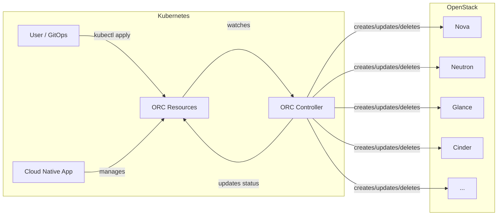

# openstack-resource-controller

_Deploy your OpenStack resources in a declarative way, using Kubernetes._

## What is ORC?

[**openstack-resource-controller**][orc], or **ORC**, is a Kubernetes API for
declarative management of OpenStack resources. By fully controlling the order
of OpenStack operations, it allows consumers to easily create, manage, and
reproduce complex deployments. ORC aims to be easily consumed both directly by
users, and by higher level controllers. ORC aims to cover all OpenStack APIs
which can be expressed declaratively.

ORC is based on [Gophercloud][gophercloud], the OpenStack Go SDK.

[orc]: https://github.com/k-orc/openstack-resource-controller
[gophercloud]: https://github.com/gophercloud/gophercloud

[Get Started](installation.md){ .md-button .md-button--primary }
[Core Concepts](concepts/core-concepts.md){ .md-button }

## How It Works

```mermaid
flowchart LR
    subgraph Kubernetes
        user[User / GitOps]
        app[Cloud Native App]
        orc[ORC Controller]
        crd[ORC Resources]
    end

    subgraph OpenStack
        nova[Nova]
        neutron[Neutron]
        glance[Glance]
        cinder[Cinder]
        other[...]
    end

    user -->|kubectl apply| crd
    app -->|manages| crd
    crd -->|watches| orc
    orc -->|creates/updates/deletes| nova
    orc -->|creates/updates/deletes| neutron
    orc -->|creates/updates/deletes| glance
    orc -->|creates/updates/deletes| cinder
    orc -->|creates/updates/deletes| other
    orc -->|updates status| crd
```

You define OpenStack resources as Kubernetes custom resources. ORC watches these resources and reconciles them with OpenStack, handling dependencies, retries, and status updates automatically.

## Maturity

ORC is deployed and used in production environments and is notably a dependency
of Cluster API's [OpenStack provider][capo].

The Kubernetes API is currently `v1alpha1`. The core API patterns are stable and
we do not anticipate major structural changes, but the API is still evolving as
we add new controllers and features. We do not have a timeline for graduation to
`v1beta1`.

ORC versioning follows [semver]: there will be no breaking changes within a
major release.

[semver]: https://semver.org/spec/v2.0.0.html
[capo]: https://github.com/kubernetes-sigs/cluster-api-provider-openstack

## How You Can Contribute

We welcome contributions of all kinds! Whether you're fixing bugs, adding new
controllers, reviewing code, or improving documentation, your help is greatly
appreciated. See the [Contributing guide](development/contributing.md) to get
started.

Join us on Kubernetes Slack in
[#gophercloud](https://kubernetes.slack.com/archives/C05G4NJ6P6X). Visit
[slack.k8s.io](https://slack.k8s.io) for an invitation.
